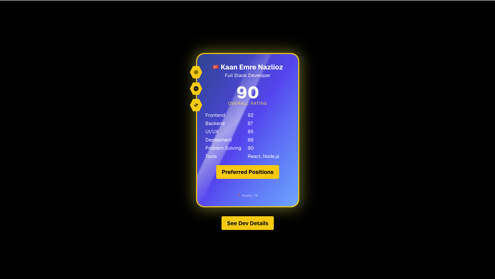
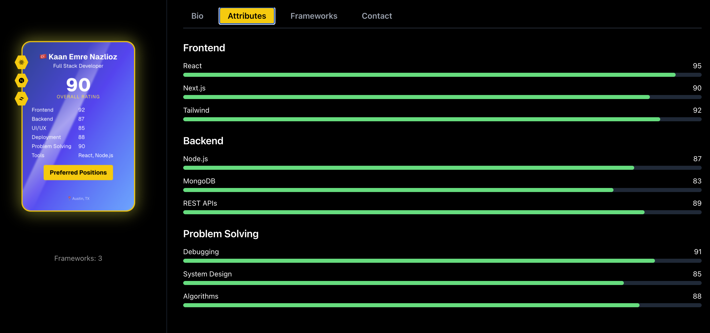
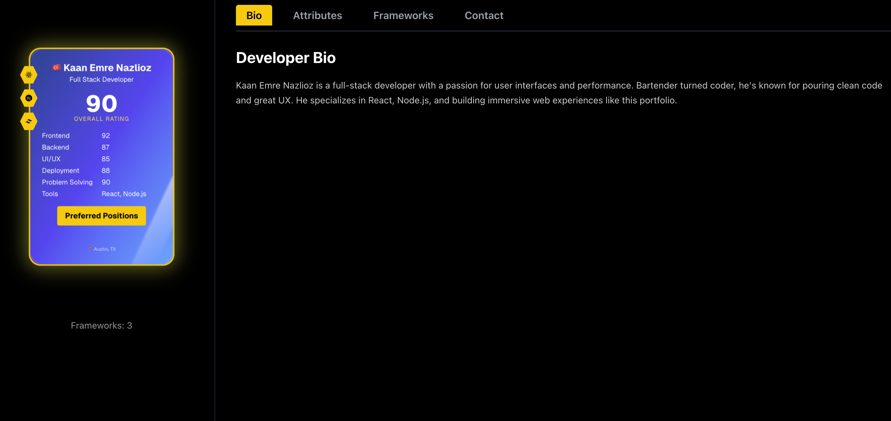
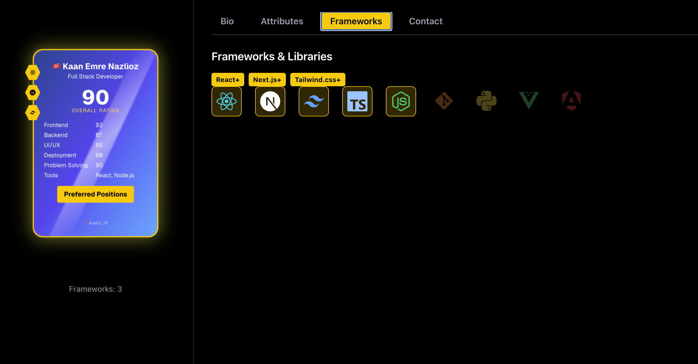

# KEN – Developer Portfolio  
**Live Demo:** [https://portfolio-25-navy.vercel.app](https://portfolio-25-navy.vercel.app)

This project is a dynamic, FIFA-style developer portfolio for **Kaan Emre Nazlioz**. Inspired by the EA FC player card interface, it showcases skills and experience in a creative, gamified layout with interactive card reveals, tabbed attributes, and a responsive mobile-first design.

---

## Features

- Card reveal animation with confetti effect
- FIFA-style tab navigation: Bio, Attributes, Frameworks, Contact
- UI sounds triggered by keyboard or click
- Framer Motion transitions
- Dark mode default (text displays correctly in both themes)
- Fully mobile-responsive layout

---

## Built With

- [Next.js](https://nextjs.org/) – App router and SSR support
- [Tailwind CSS](https://tailwindcss.com/) – Utility-first CSS
- [Framer Motion](https://www.framer.com/motion/) – Animation library
- [TypeScript](https://www.typescriptlang.org/) – Static typing
- [Vercel](https://vercel.com/) – Deployment platform

---

## Screenshots

## Home View 


## Dev Attributes

## Dev Bio

## Dev Frameworks



---

## Local Setup

Clone and run locally:

```bash
git clone https://github.com/nazliozemrek/portfolio-25.git
cd portfolio-25
npm install
npm run dev
